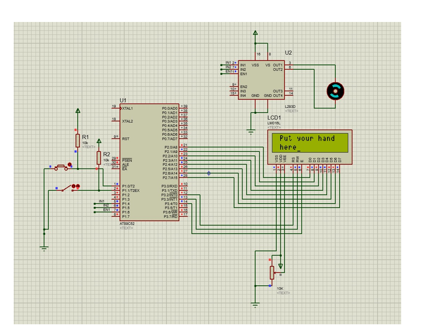

# RTOS-Based Automatic Water Tap Control System

## Project Overview
This project implements a Real-Time Operating System (RTOS) to automate the control of water supply at public toilet taps. Designed with sustainability in mind, the system minimizes water wastage by managing water flow efficiently based on real-time sensor data.

## Features
- **Real-Time Task Management**: Utilizes RTOS to handle multiple tasks such as:
  - Monitoring sensor inputs.
  - Controlling the solenoid valve for water flow.
  - Updating system status indicators (e.g., LEDs or LCD).
- **Automatic Water Flow Control**: Detects user presence via proximity sensors and triggers water flow accordingly.
- **Water Conservation**: Ensures water is only supplied when needed, reducing wastage.
- **Scalable and Modular Design**: Can be extended to include additional features such as timed water flow or user usage tracking.

## Components Required
- **AT89S52 microcontroller development board**
- **8051/AVR ISP Programmer**
- **16x2 LCD Display**
- **Infrared Sensor**
- **L239D motor driver**
- **Resistor (10kΩ)**
- **Potentiometer**

## Technologies Used
- **Development Tools**:
  - Keil IDE for firmware development.
  - Proteus for circuit simulation.
- **Hardware Components**:
  - IR/Proximity Sensors
  - Solenoid Valve
  - Microcontroller Development Board

## Code Functionality
### 1. Initialize System:
- Sets up the LCD (LCD_INIT) and Timer 2 for delay generation using the 16-bit auto-reload mode.
- Timer values (RCAP2H, RCAP2L) are set for a 50ms delay.

### 2. Monitor Sensors:
- A presence sensor (P_SENSOR) and hand sensor (H_SENSOR) are connected to the microcontroller.
- If a person is detected (P_SENSOR), the system prompts the user via an LCD to place their hand under the tap (Display routine).

### 3. Control Water Flow:
- Once a hand is detected, the tap is opened by activating the motor to rotate counterclockwise (Motor_ACW).
- The tap stays open for 2 seconds to allow water flow.
- The motor stops (Motor_STOP) and remains idle as long as the hand is detected.
- If the hand is removed, the tap closes by rotating the motor clockwise (Motor_CW) for 2 seconds.

### 4. LCD Interface:
- Displays messages like “Put your hand here” to guide users.
- LCD_CMD and LCD_DATA handle command and data communication with the LCD.

### 5. Delays:
- **Wait_2s**: Creates a 2-second delay by calling Timer 2 (50ms * 40 cycles).
- **Delay**: Generates a small delay loop for LCD stability.

### 6. Motor Control:
- Uses EN1, IN1, and IN2 pins to control the motor direction:
  - Counterclockwise (Motor_ACW): Water flow starts.
  - Clockwise (Motor_CW): Water flow stops.
  - Stop (Motor_STOP): Motor is idle.

### 7. Flow of Execution:
- **Main Loop (Loop)**:
  - Continuously checks for user presence using the presence sensor.
  - Displays a message if a user is detected.
  - Waits for the user to place their hand under the tap.

### 8. Water Supply Control:
- Opens the tap when a hand is detected.
- Maintains the water flow as long as the hand remains.
- Closes the tap when the hand is removed.

### 9. Exit:
- Clears the LCD when the user leaves.

## How to Run the Project
1. Clone the repository:
   ```bash
   git clone https://github.com/yourusername/rtos-water-tap-system.git
   ```
2. Open the project in the Keil IDE or your preferred development environment.
3. Load the firmware onto the microcontroller.
4. Set up the hardware components as per the circuit diagram provided.
5. Power the system and observe the automated water flow control in action.

## Circuit Diagram

(Include the uploaded circuit image file here with the filename `circuit_diagram.png`.)

## Future Enhancements
- Add a timed flow feature to limit water usage per user.
- Integrate IoT for remote monitoring and control.
- Include user tracking for analytics on water usage.

## License
This project is licensed under the [MIT License](LICENSE).

## Contributing
Contributions are welcome! Feel free to fork this repository and submit pull requests for improvements or new features.

## Contact
For questions or feedback, please reach out to:
- **Name**: Shruti Shukla
- **Email**: shrutishukla182@gmail.com
- **GitHub**: [shrutishukla1](https://github.com/shrutishukla1)
